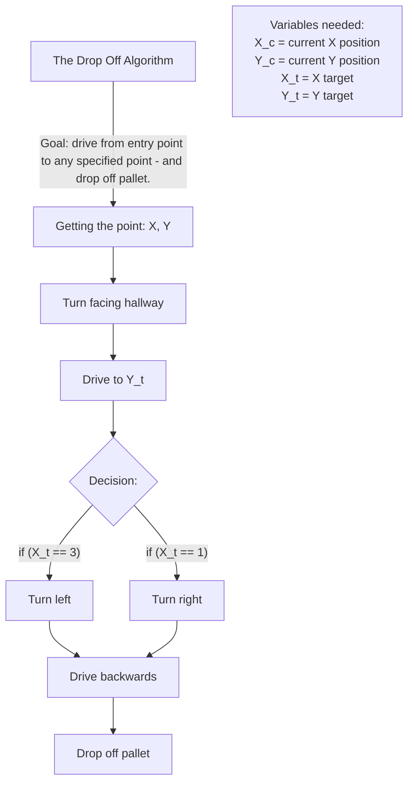

```mermaid


flowchart TB
    A[The Drop Off Algorithm] --Goal: drive from entry point to any specified point - and drop off pallet.

    -->B[Getting the point: X, Y]
    -->C[Turn facing hallway]
    -->E[Drive to Y_t]
    -->F{Decision:} --if (X_t == 3) -->H[Turn left]-->J
    F-- if (X_t == 1) -->G[Turn right] -->J

    J[Drive backwards] --> K[Drop off pallet]

    VARIABLES[Variables needed: 
    X_c = current X position
    Y_c = current Y position
    X_t = X target
    Y_t = Y target
    ]
```