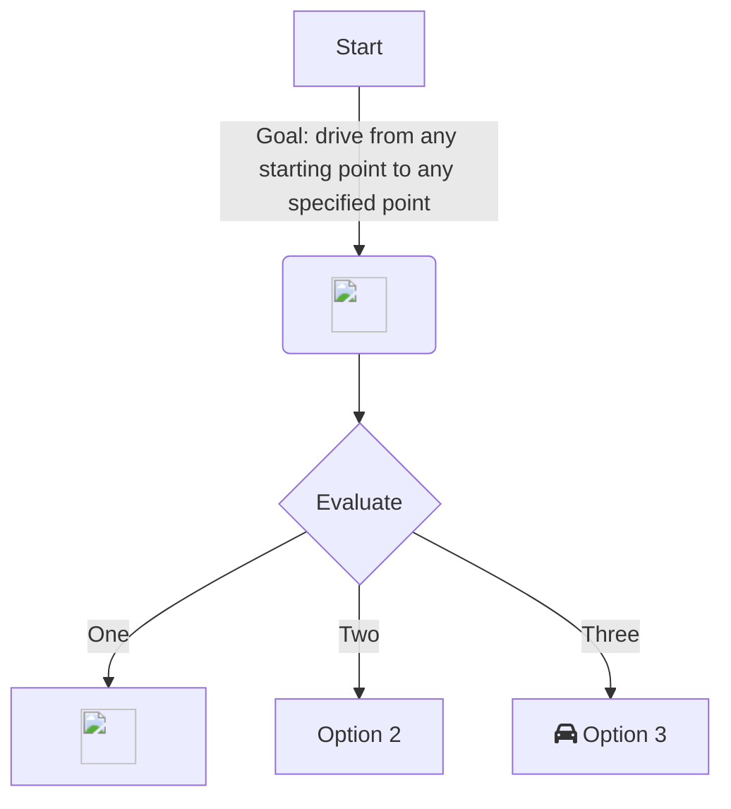

```mermaid


flowchart TB
    A[Start] --Goal: drive from any starting point to any specified point--> B(<img src='^Grid.jpg^' width='40' height='40' />)
    B --> C{Evaluate}
    C -- One --> D[<img src='^^' width='40' height='40' />]
    C -- Two --> E[Option 2]
    C -- Three --> F[fa:fa-car Option 3]
    


```