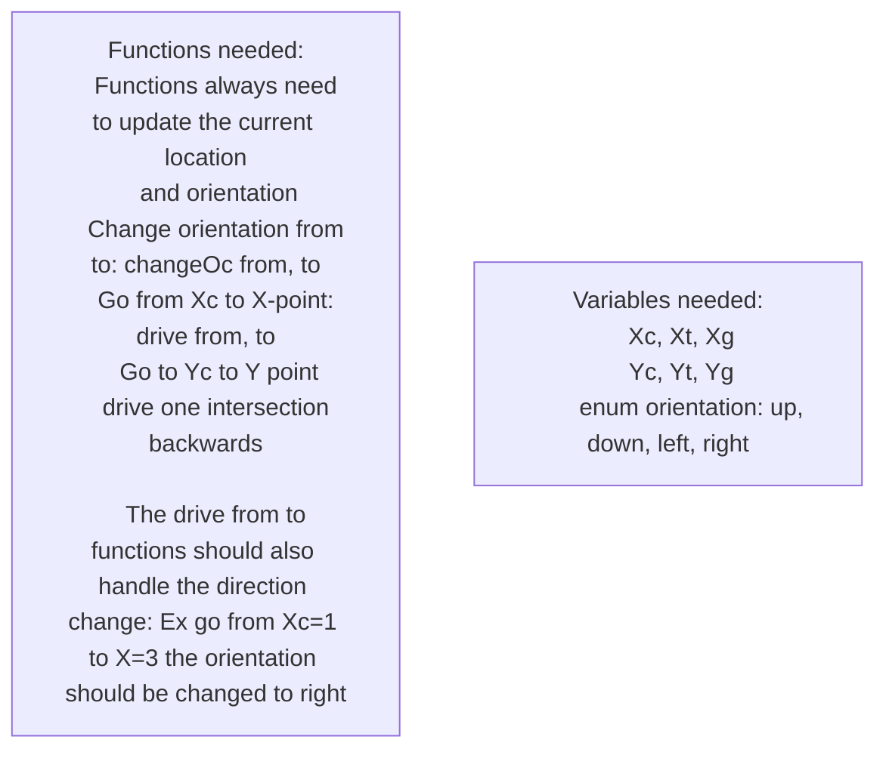

```mermaid
flowchart TB
    Func[
    Functions needed:
    Functions always need to update the current location
    and orientation
    Change orientation from to: changeOc from, to
    Go from Xc to X-point: drive from, to
    Go to Yc to Y point
    drive one intersection backwards

    The drive from to functions should also handle the direction change: Ex go from Xc=1 to X=3 the orientation should be changed to right
    ]
    Var[
    Variables needed:
    Xc, Xt, Xg
    Yc, Yt, Yg
        enum orientation: up, down, left, right
    ]

```